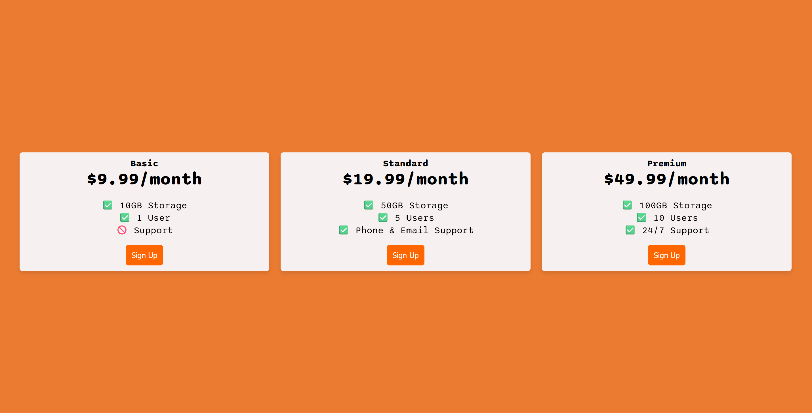

# 💸 Responsive Pricing Table using Flexbox

This is a simple responsive pricing table layout built using **HTML**, **CSS**, and **Flexbox**. The layout showcases a clean, structured pricing section for a website, with responsiveness handled using media queries.

---

## 🚀 Features

- ✅ Built with **Flexbox** for layout alignment
- 📱 **Responsive design**: adapts to screen sizes
- 💻 Layout changes dynamically when window width is below **1250px**
- 🧼 Clean and readable code for easy customization

---

## 📸 Preview




---

## 🛠️ Technologies Used

- HTML5
- CSS3
- Flexbox

---

## 🧠 What I Learned

- How to use Flexbox for aligning and distributing space between elements
- Creating responsive layouts using media queries
- Managing layout changes based on screen width

---

## 🧪 How to Run the Project

1. Clone the repository:
   ```bash
   git clone https://github.com/vip23anchib/flexbox-pricing-table.git


[def]: image.png
[def2]: image.png